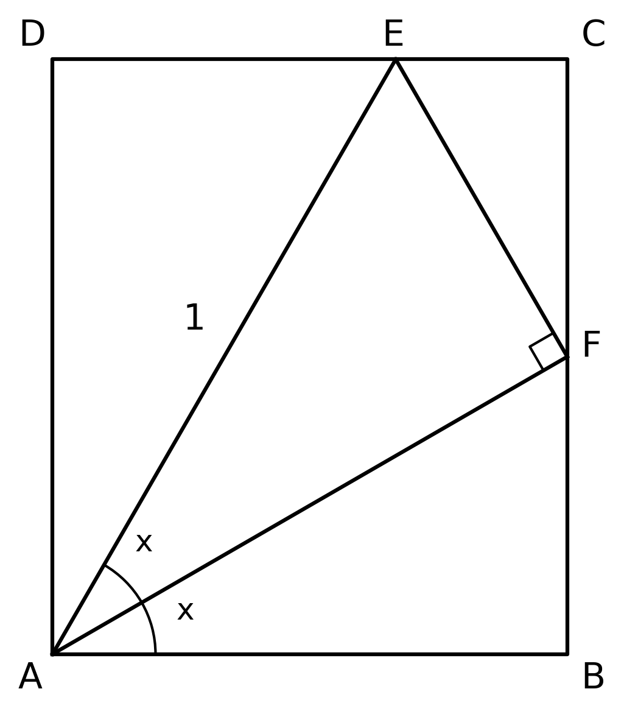
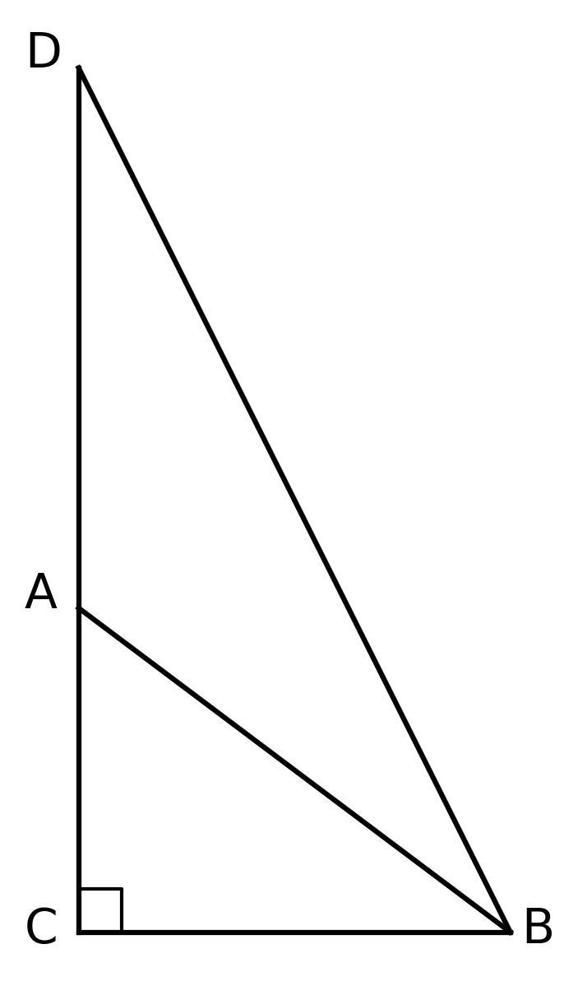
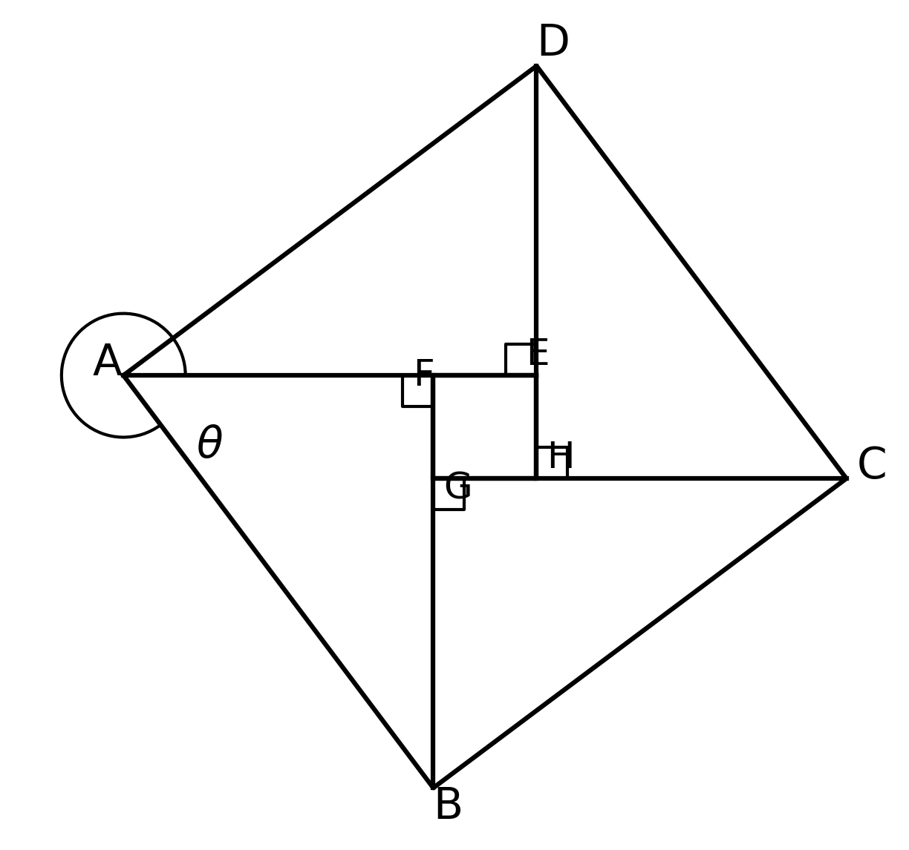

# 🎯 三角恒等变换与“无言的证明” 题型攻坚与拓展 (学生版)

## 💡 一、 命题密码解析与核心知识点总结
- **核心概念透析**：三角恒等变换不仅是代数推导的工具，其背后往往隐藏着深厚的几何背景。“无言的证明”（Wordless Proof）正是利用精妙的几何图形（如矩形、直角三角形、弦图等）将抽象的三角代数公式直观化。通过几何图形中的线段长度、角度关系与面积运算，能够秒杀复杂的恒等代换。
- **考查知识点**：
  1. 正弦、余弦的二倍角公式的几何意义及代数化简。
  2. 锐角三角函数的定义（结合直角三角形的“追边法”：边长 = 斜边 $\times$ $\sin/\cos$）。
  3. 面积法在三角恒等式证明中的应用。
  4. 同角三角函数关系与诱导公式的综合运用。
- **高考占比与频次**：三角恒等变换在高考中以选择、填空及解答题第一问高频出现。随着新高考强调“数学文化”与“核心素养”，借助几何图形考查三角恒等式（即代数几何综合）成为了拉开区分度的新颖考法。

## 🚧 二、 破题核心通法与易错防雷
- **核心解题通法/SOP模型**：
  - **几何代数化（追边法）**：在遇到“无言的证明”图形题时，首先锁定含有“1”的边（通常是斜边）。然后顺着直角三角形，利用 $\sin$ 和 $\cos$ 依次写出所有边长。
  - **等量关系构建**：利用矩形的对边相等（如 $AD=BC$, $AB=CD$），或图形的面积拼接（大图形面积 = 小图形面积之和），列出等式，化简即可得出对应的三角公式。
  - **降幂与倍角互化**：代数计算中，见平方想降幂（$\cos^2 x = \frac{1+\cos 2x}{2}$），见乘积想二倍角（$2\sin x \cos x = \sin 2x$）。
- **易错防雷区**：
  1. 几何图形中角度推导错误，尤其是利用互余关系时正负号弄反。
  2. 在使用二倍角公式逆用时，常丢掉系数 $\frac{1}{2}$（如 $\sin x \cos x = \frac{1}{2} \sin 2x$）。

## ✍️ 三、 课堂演练与课后挑战（分级题库）
> 遵循认知规律，将题目分为三个阶梯，逐步突破。

### 【第一阶：典例精讲】（课堂重难点突破）
**【原题】**
(多选) (2024 河北秦皇岛部分示范高中三模，9) 美国数学史家、穆伦堡学院名誉数学教授威廉·邓纳姆在1994年出版的《The Mathematical Universe》一书中写道：“相比之下，数学家达到的终极优雅是所谓的‘无言的证明’，在这样的证明中一个极好的、令人信服的图示就传达了证明，甚至不需要任何解释。很难比它更优雅了。”右图正是数学家所达到的“终极优雅”，该图（四边形 $ABCD$ 为矩形）完美地展示并证明了正弦和余弦的二倍角公式，则可推导出的正确选项为 (    )

A. $AD = \sin 2x$
B. $AB = \sin 2x$
C. $DE = \cos 2x$
D. $\frac{S_{\triangle ABF}}{S_{\triangle AEF}} = \cos^2 x$

*(此处利用下划线或空行预留充足的解题空白)*
            

### 【第二阶：当堂当练】（实战暴露问题，难度递增）
**【变式 1】**
已知 $\sin \alpha = \frac{3}{5}$，且 $\alpha$ 为锐角，求 $\cos 2\alpha$ 和 $\sin 2\alpha$ 的值.

*(留白)*
         

**【变式 2】**
化简代数式：$\frac{\sin 2x}{1 + \cos 2x}$ （要求结果用 $x$ 的三角函数表示）.

*(留白)*
         

**【变式 3】**
已知 $\tan \frac{\alpha}{2} = 2$，求 $\sin \alpha$ 与 $\cos \alpha$ 的值.

*(留白)*
         

**【变式 4】**
(半角公式的几何证明) 如图，在 $Rt\triangle ABC$ 中，$\angle C=90^\circ$，$AC=b$，$BC=a$，$AB=c$. 延长 $AC$ 到点 $D$，使得 $AD=AB=c$，连接 $BD$.
(1) 证明：$\angle D = \frac{1}{2}\angle BAC$.
(2) 借助该图形证明：$\tan \frac{A}{2} = \frac{\sin A}{1 + \cos A}$.

*(留白)*
         

**【变式 5】**
在 $\triangle ABC$ 中，已知内角 $A = \frac{\pi}{3}$，且 $\sin B + \sin C = \frac{3}{2}$，求 $\cos B + \cos C$ 的值.

*(留白)*
         

### 【第三阶：课后测试挑战】（巩固提升与压轴挑战，最少3道独立题，难度递增）
**【课后测试 1】（巩固基础）**
已知 $\cos(\alpha - \frac{\pi}{4}) = \frac{1}{3}$，求 $\sin 2\alpha$ 的值.

*(留白)*
         

**【课后测试 2】（能力进阶）**
设函数 $f(x) = \sin x \cos x - \cos^2 x + \frac{1}{2}$，求函数 $f(x)$ 的最大值及最小正周期.

*(留白)*
         

**【课后测试 3】（压轴挑战）**
(赵爽弦图中的三角恒等式) 如图，四个全等的直角三角形（如 $\triangle AEF$）拼成一个大正方形 $ABCD$，其中直角顶点均落在外正方形的边上。这四个三角形的斜边在内部围成了一个小正方形 $EFGH$. 设直角三角形中较小的锐角为 $\theta$（如图 $\angle FAB = \theta$）. 若大正方形 $ABCD$ 的面积为 1，内部小正方形 $EFGH$ 的面积为 $\frac{1}{9}$，求 $\sin 2\theta$ 的值.

*(留白)*
         

## ✍️ 四、 我的避坑总结与复盘
> 灵魂三问：我在这道题卡在了哪一步？我是怎么掉进坑里的？下次看到什么条件我必须条件反射？
_________________________________________________________________
_________________________________________________________________
_________________________________________________________________
_________________________________________________________________

