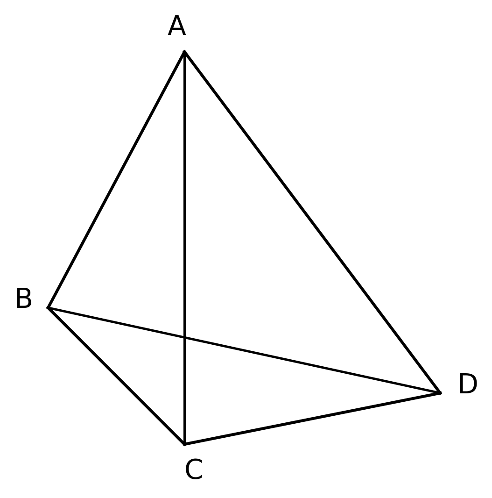
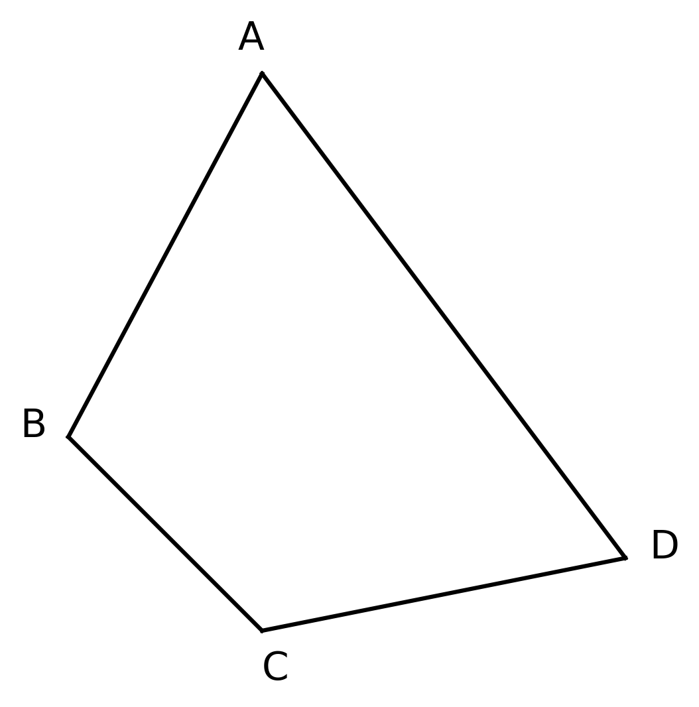

# 🧑‍🏫 托勒密定理与四边形面积最值 题型深度解构 (教师版)

## 💡 一、 命题密码解析与核心知识点总结
- **核心概念透析**：本题型深刻融合了平面几何与解三角形的知识，以古希腊数学家托勒密的伟大发现为背景。托勒密定理揭示了圆内接四边形边与对角线的极致和谐，而婆罗摩笈多公式（Brahmagupta's formula）则指明了四边形在边长固定时，共圆状态下的面积最大化原则。这些理论是解决几何最值问题的高维武器。
- **考查知识点**：
  1. 托勒密定理及托勒密不等式的应用。
  2. 运用余弦定理在两个三角形中建立方程，解出特定角的余弦值。
  3. 四边形面积的最值原理及其代数推导（均值不等式与配凑）。
- **北京高考考情分析**：在历年北京高考（如18卷或近年的新高考中），解三角形大题经常在第二问或第三问中设置“四边形面积/周长/对角线求最值”的压轴设问，平均分值5-7分，常常需要结合正余弦定理与几何不等式。

> 🗣️ **教师授课引导思路：**
> 讲授此类阅读理解与新定义题型时，第一步是“翻译”。托勒密不等式翻译成代数式就是 $AB \cdot CD + BC \cdot AD \ge AC \cdot BD$。告诉学生：只要看到四边形的边长和对角线同时出现求最值，托勒密就是我们跨界降维打击的核武器！

## 🚧 二、 破题核心通法与易错防雷
- **核心解题通法/SOP模型**：
  - **托勒密不等式求对角线**：遇到凸四边形求对角线乘积的最值，立刻想到 $AC \cdot BD \le AB \cdot CD + BC \cdot AD$，当且仅当四点共圆时取等号。
  - **对角线双余弦建系法**：在四边形 $ABCD$ 中，若已知四边，连接对角线（如 $BD$），分别在 $\triangle ABD$ 和 $\triangle BCD$ 中对 $BD$ 使用余弦定理，利用四点共圆时对角互补（$\cos C = -\cos A$）构建方程求解。
- **易错防雷区**：
  - 🧨 **易错点**：使用托勒密不等式求最值时，忽略等号成立的条件（四点共圆），导致最值根本无法取到。 → **正确做法**：求出最值后，必须检查四点共圆时该几何构型是否真实存在（如本题第一问检验直径与弦长的关系）。
  - 🧨 **易错点**：在求面积时，忘记应用对角互补 $\sin C = \sin A$ 进行整体代换。 → **正确做法**：圆内接四边形对角互补，正弦值相等，余弦值互为相反数。

## 📖 三、 课堂演练与课后挑战（分级精讲精析）

### 【第一阶：典例精讲】（课堂重难点突破）
**【典例】(2025届广东部分学校开学考, 16)**
古希腊数学家托勒密对凸四边形进行研究，终于有重大发现：任意一凸四边形，两组对边的乘积之和不小于两条对角线的乘积，当且仅当四点共圆时等号成立。且若给定凸四边形的四条边长，四点共圆时四边形的面积最大。根据上述材料，解决以下问题：
如图，在凸四边形 $ABCD$ 中，
(1) 如图 1，若 $AB = \sqrt{2}$，$BC = 1$，$\angle ACD = \frac{\pi}{2}$，$AC = CD$，求线段 $BD$ 长度的最大值；
(2) 如图 2，若 $AB=a$，$BC=b$，$CD=c$，$DA=d$，求四边形 $ABCD$ 面积取得最大值时角 $A$ 的余弦值，并求出四边形 $ABCD$ 面积的最大值.

> **🗣️ 教师授课引导思路：**
> - **第一问切入点**：已知 $\angle ACD = \frac{\pi}{2}$ 和 $AC=CD$，这不是妥妥的等腰直角三角形吗？设出 $AC=CD=x$，马上就能用勾股定理表达出 $AD$！此时我们有四边形的三条边和一条对角线（含参数 $x$），果断套用材料里的托勒密不等式！
> - **第二问切入点**：材料已经剧透了“四点共圆时面积最大”。共圆有什么好处？对角互补啊！$\cos C = -\cos A$。既然要求 $\cos A$，怎么把 $\cos A$ 和四条边联系起来？连对角线 $BD$，在两个三角形里分别写余弦定理，消掉 $BD$，大功告成！

**【规范解答】**
**(1) 解：**
设 $AC = CD = x \ (x>0)$。在 Rt$\triangle ACD$ 中，$\angle ACD = \frac{\pi}{2}$，
$\therefore AD = \sqrt{AC^2 + CD^2} = \sqrt{2}x$。
由材料中的托勒密不等式，对于凸四边形 $ABCD$，有：
$AB \cdot CD + BC \cdot AD \ge AC \cdot BD$。
代入已知边长数据得：
$\sqrt{2} \cdot x + 1 \cdot \sqrt{2}x \ge x \cdot BD$。
💯 阅卷踩分点：准确代入托勒密不等式并化简是第一问拿分的关键。
$\because x > 0$，两边同除以 $x$，得 $BD \le 2\sqrt{2}$。
当且仅当 $A,B,C,D$ 四点共圆时等号成立。
（检验：当 $BD = 2\sqrt{2}$ 时，共圆，$\angle ACD=90^\circ$ 表明 $AD$ 为直径，可验证此构型真实存在）
$\therefore$ 线段 $BD$ 长度的最大值为 $2\sqrt{2}$。

**(2) 解：**
由材料知，当四边形 $ABCD$ 内接于圆时，面积取得最大值。
此时四点共圆，必有 $\angle A + \angle C = \pi$，$\therefore \cos C = -\cos A$，$\sin C = \sin A$。
连接 $BD$，在 $\triangle ABD$ 中，由余弦定理：
$BD^2 = a^2 + d^2 - 2ad \cos A$。
在 $\triangle BCD$ 中，由余弦定理：
$BD^2 = b^2 + c^2 - 2bc \cos C = b^2 + c^2 + 2bc \cos A$。
两式联立，得：
$a^2 + d^2 - 2ad \cos A = b^2 + c^2 + 2bc \cos A$。
$\therefore \cos A = \frac{a^2 + d^2 - b^2 - c^2}{2(ad + bc)}$。
💯 阅卷踩分点：利用两个三角形公共边列出余弦定理等式，是解三角形极其重要的通法。

四边形的面积 $S = S_{\triangle ABD} + S_{\triangle BCD} = \frac{1}{2}ad \sin A + \frac{1}{2}bc \sin C$。
$\because \sin C = \sin A$，
$\therefore S_{max} = \frac{1}{2}(ad+bc)\sin A$。
$\because \sin A = \sqrt{1 - \cos^2 A} = \sqrt{1 - \left[\frac{a^2+d^2-b^2-c^2}{2(ad+bc)}\right]^2}$
$= \frac{\sqrt{4(ad+bc)^2 - (a^2+d^2-b^2-c^2)^2}}{2(ad+bc)}$。
代入面积公式，得：
$S_{max} = \frac{1}{4} \sqrt{ [2(ad+bc) + (a^2+d^2-b^2-c^2)] \cdot [2(ad+bc) - (a^2+d^2-b^2-c^2)] }$
$= \frac{1}{4} \sqrt{ [(a+d)^2 - (b-c)^2] \cdot [(b+c)^2 - (a-d)^2] }$
$= \frac{1}{4} \sqrt{(a+d+b-c)(a+d-b+c)(b+c+a-d)(b+c-a+d)}$。
设 $p = \frac{a+b+c+d}{2}$，则 $S_{max} = \sqrt{(p-a)(p-b)(p-c)(p-d)}$。
（此即著名的婆罗摩笈多公式）

**【变式 1】**
在圆内接四边形 $ABCD$ 中，$AB=3, BC=5, CD=3, \angle ABC = 120^\circ$. 求对角线 $BD$ 的长。
> **🗣️ 教师授课引导思路：**
> 托勒密定理的直接应用！但是在用之前，我们还得先把隐藏的对角线 $AC$ 和边 $AD$ 找出来。在 $\triangle ABC$ 中已知两边一夹角，先求谁？对，$AC$！在四点共圆中，$\angle ADC$ 是多少度？再在 $\triangle ADC$ 里把 $AD$ 求出来，最后祭出托勒密大招秒杀 $BD$！

**【精析】**
在 $\triangle ABC$ 中，由余弦定理得：
$AC^2 = AB^2 + BC^2 - 2AB \cdot BC \cos 120^\circ = 9 + 25 - 2 \times 3 \times 5 \times (-\frac{1}{2}) = 49$。
$\therefore AC = 7$。
$\because$ 四边形 $ABCD$ 内接于圆，$\therefore \angle ADC = 180^\circ - \angle ABC = 60^\circ$。
在 $\triangle ADC$ 中，设 $AD = x$，由余弦定理得：
$AC^2 = AD^2 + CD^2 - 2AD \cdot CD \cos 60^\circ \implies 49 = x^2 + 9 - 3x$。
化简得 $x^2 - 3x - 40 = 0$，解得 $x=8$ 或 $x=-5$（舍去）。
$\therefore AD = 8$。
由托勒密定理，$AC \cdot BD = AB \cdot CD + BC \cdot AD$。
代入数据得：$7 \cdot BD = 3 \times 3 + 5 \times 8 = 49$。
解得 $BD = 7$。

### 【第二阶：当堂当练】（实战暴露问题，难度递增）
**【变式 2】**
已知 $\triangle ABC$ 为等边三角形，点 $P$ 在 $\triangle ABC$ 所在的平面内，且 $PA=2, PB=3$，求 $PC$ 的最大值。
> **🗣️ 教师授课引导思路：**
> 当看到求平面内一点到三角形三个顶点距离的关系时，托勒密不等式是绝配。把 $P,A,B,C$ 四点看成一个四边形的顶点！
**【精析】**
设等边 $\triangle ABC$ 的边长为 $a$。
在四边形 $PABC$ 中，由托勒密不等式：
$PA \cdot BC + PB \cdot AC \ge PC \cdot AB$。
代入 $BC=AC=AB=a$，得 $2a + 3a \ge PC \cdot a$。
$\because a>0$，$\therefore PC \le 5$。
当且仅当 $P,A,B,C$ 四点共圆，且 $P,C$ 分离在弦 $AB$ 两侧时取等号。
$\therefore PC$ 的最大值为 5。
💡 **高手速解/二级结论视角**：在圆内接四边形中，若包含等边三角形，托勒密定理直接退化为线段和的线性关系，这是极秒的结论。

**【变式 3】**
已知平面四边形 $ABCD$ 的四条边长分别为 $AB=1, BC=2, CD=3, DA=4$. 求该四边形面积的最大值。
**【精析】**
由典例推导的婆罗摩笈多公式，四边形面积最大时四点共圆。
此时半周长 $p = \frac{1+2+3+4}{2} = 5$。
$S_{max} = \sqrt{(5-1)(5-2)(5-3)(5-4)} = \sqrt{4 \times 3 \times 2 \times 1} = 2\sqrt{6}$。
💯 阅卷踩分点：直接应用公式在填空题中极快，但若在解答题中，需重新叙述共圆及余弦定理的建构过程。

**【变式 4】**
四边形 $ABCD$ 内接于圆，$AC$ 与 $BD$ 互相垂直。若 $AB=2, BC=3, CD=4$，求 $AD$ 的长。
**【精析】**
$\because AC \perp BD$，设交点为 $O$。
在 Rt$\triangle AOB$ 和 Rt$\triangle COD$ 中：$AB^2 + CD^2 = OA^2 + OB^2 + OC^2 + OD^2$。
在 Rt$\triangle BOC$ 和 Rt$\triangle AOD$ 中：$BC^2 + AD^2 = OB^2 + OC^2 + OA^2 + OD^2$。
$\therefore AB^2 + CD^2 = BC^2 + AD^2$。
代入数据：$2^2 + 4^2 = 3^2 + AD^2 \implies 20 = 9 + AD^2 \implies AD^2 = 11$。
$\therefore AD = \sqrt{11}$。

**【变式 5】**
在圆内接四边形 $ABCD$ 中，$\angle A = 60^\circ$，$AB=4, AD=6$. 求 $\triangle BCD$ 面积的最大值。
**【精析】**
在 $\triangle ABD$ 中，$BD^2 = 4^2 + 6^2 - 2 \times 4 \times 6 \cos 60^\circ = 16+36-24 = 28$。
$\because ABCD$ 共圆，$\therefore \angle C = 180^\circ - 60^\circ = 120^\circ$。
设 $BC = x, CD = y$。在 $\triangle BCD$ 中由余弦定理得：
$BD^2 = x^2 + y^2 - 2xy \cos 120^\circ = x^2 + y^2 + xy = 28$。
由基本不等式 $x^2 + y^2 \ge 2xy$，得 $3xy \le x^2+y^2+xy = 28 \implies xy \le \frac{28}{3}$。
$S_{\triangle BCD} = \frac{1}{2}xy \sin 120^\circ = \frac{\sqrt{3}}{4}xy \le \frac{\sqrt{3}}{4} \times \frac{28}{3} = \frac{7\sqrt{3}}{3}$。
当且仅当 $x=y$ 时取等号。$\triangle BCD$ 面积最大值为 $\frac{7\sqrt{3}}{3}$。

### 【第三阶：课后测试挑战】（巩固提升与压轴挑战，最少3道独立题，难度递增）
**【课后测试 1】（巩固基础）**
在凸四边形 $ABCD$ 中，$AB=2, BC=3, CD=2, DA=3$. 求该四边形对角线乘积 $AC \cdot BD$ 的最大值。
> **🗣️ 教师授课引导思路：**
> 继续祭出托勒密不等式！对边乘积之和大于等于对角线乘积。

**【精析】**
由托勒密不等式，$AC \cdot BD \le AB \cdot CD + BC \cdot DA = 2 \times 2 + 3 \times 3 = 4 + 9 = 13$。
当且仅当 $ABCD$ 四点共圆时等号成立。
由于对边相等，该四边形为平行四边形。内接于圆的平行四边形必为矩形。
当 $ABCD$ 为矩形时，$AC=BD=\sqrt{2^2+3^2}=\sqrt{13}$，此时 $AC \cdot BD = 13$。最大值为 13。

**【课后测试 2】（能力进阶）**
在圆内接四边形 $ABCD$ 中，$AB=2, BC=6, AD=4, CD=4$. 设对角线交点为 $P$，求对角线 $AC$ 与 $BD$ 的长度。
**【精析】**
💯 阅卷踩分点：双余弦定理消元法的标准实战！
在 $\triangle ABC$ 和 $\triangle ADC$ 中连 $AC$：
$AC^2 = 2^2 + 6^2 - 2 \times 2 \times 6 \cos B = 40 - 24 \cos B$。
$AC^2 = 4^2 + 4^2 - 2 \times 4 \times 4 \cos D = 32 - 32 \cos D$。
$\because \cos D = -\cos B$，$\therefore 40 - 24 \cos B = 32 + 32 \cos B \implies 56 \cos B = 8 \implies \cos B = \frac{1}{7}$。
$\therefore AC^2 = 40 - \frac{24}{7} = \frac{256}{7} \implies AC = \frac{16\sqrt{7}}{7}$。
同理在 $\triangle ABD$ 和 $\triangle BCD$ 中连 $BD$：
$BD^2 = 2^2 + 4^2 - 2 \times 2 \times 4 \cos A = 20 - 16 \cos A$。
$BD^2 = 6^2 + 4^2 - 2 \times 6 \times 4 \cos C = 52 + 48 \cos A$。
$\therefore 20 - 16 \cos A = 52 + 48 \cos A \implies 64 \cos A = -32 \implies \cos A = -\frac{1}{2}$。
$\therefore BD^2 = 20 - 16 \times (-\frac{1}{2}) = 28 \implies BD = 2\sqrt{7}$。

**【课后测试 3】（压轴挑战）**
已知四边形 $ABCD$ 满足 $AB \cdot CD + BC \cdot AD = AC \cdot BD$。若 $\triangle ABC$ 为边长为 2 的等边三角形，求四边形 $ABCD$ 面积的最大值。
> **🗣️ 教师授课引导思路：**
> 压轴题的题眼在第一句话。条件给出等式成立，说明这绝不仅是一个普通的四边形，而是一个圆内接四边形！那么点 $D$ 就必然在 $\triangle ABC$ 的外接圆上。三角形面积固定了，要让总面积最大，$\triangle ADC$ 的面积得最大，高何时最大呢？

**【精析】**
$\because AB \cdot CD + BC \cdot AD = AC \cdot BD$，由托勒密定理可知，$ABCD$ 四点共圆。
$\because \triangle ABC$ 是边长为 2 的等边三角形，
$\therefore$ 该圆即为 $\triangle ABC$ 的外接圆。其外接圆半径 $R = \frac{2}{2\sin 60^\circ} = \frac{2}{\sqrt{3}} = \frac{2\sqrt{3}}{3}$。
$S_{ABCD} = S_{\triangle ABC} + S_{\triangle ADC}$。
其中 $S_{\triangle ABC} = \frac{\sqrt{3}}{4} \times 2^2 = \sqrt{3}$，为定值。
要使 $S_{ABCD}$ 最大，只需 $S_{\triangle ADC}$ 最大。
弦 $AC=2$ 固定，当点 $D$ 位于劣弧 $\overset{\frown}{AC}$ 的中点时，点 $D$ 到弦 $AC$ 的距离 $h$ 最大。
此时圆心 $O$ 在 $h$ 的延长线上，且 $h = R - R \cos 60^\circ = \frac{R}{2} = \frac{\sqrt{3}}{3}$。
$\therefore (S_{\triangle ADC})_{max} = \frac{1}{2} \cdot AC \cdot h = \frac{1}{2} \times 2 \times \frac{\sqrt{3}}{3} = \frac{\sqrt{3}}{3}$。
$\therefore (S_{ABCD})_{max} = \sqrt{3} + \frac{\sqrt{3}}{3} = \frac{4\sqrt{3}}{3}$。
💯 阅卷踩分点：利用外接圆模型将代数极值转化为几何位置上的距离极值，是高考大题压轴的核心素养体现。

