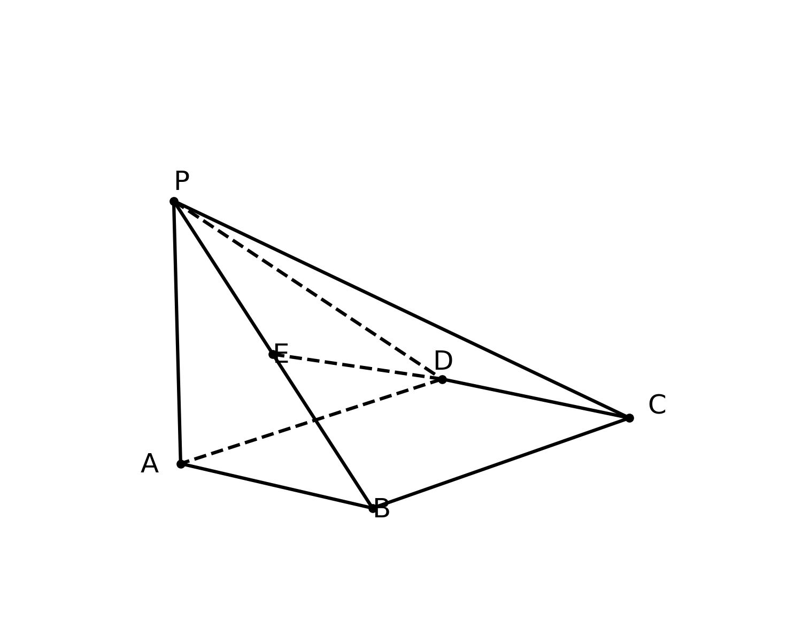
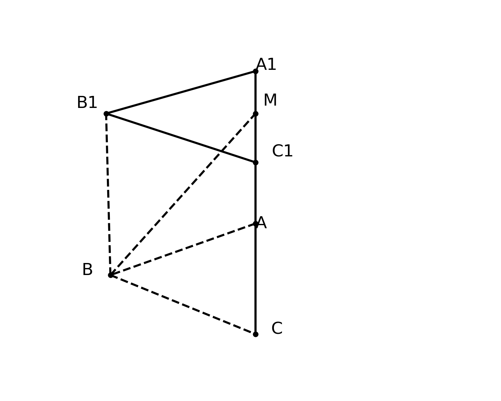
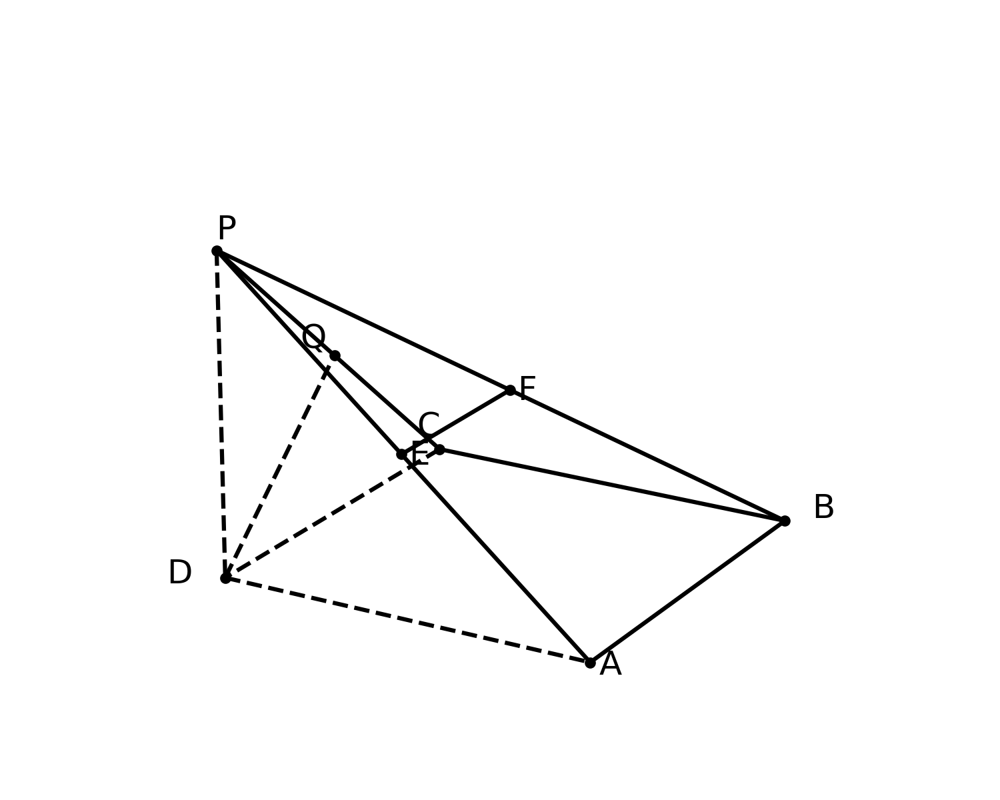

# 🧑‍🏫 立体几何综合证明与空间向量计算 题型深度解构 (教师版)

## 💡 一、 命题密码解析与核心知识点总结
- **核心概念透析**：立体几何综合题主要考查空间中线线、线面、面面之间位置关系的证明，以及空间角和距离的计算。其中，垂直关系与平行关系的转化是解题的底层逻辑。而在涉及距离和角度计算时，引入空间直角坐标系将几何问题代数化，是极具普适性的降维打击策略。**（教师提示：代数化降低了空间想象的难度，但极大考验了学生的计算准确率和空间坐标敏锐度，需强加训练坐标运算。）**
- **考查知识点**：
  1. 线面平行与垂直的判定与性质。
  2. 面面垂直的性质定理（核心：寻找交线的垂线）。
  3. 空间直角坐标系的建系原则与点坐标求解。
  4. 利用法向量计算点到平面的距离、线面角、二面角。

> 🗣️ **教师授课引导思路：**
> 讲解立体几何时，可以把“寻找垂线”比喻成“找地基”，面面垂直给了我们一个绝佳的“垂直墙面”和“水平地面”的关系。遇到求距离和角度，如果实在看不出辅助线，就像“给模型装上 GPS”一样，直接上空间向量！

## 🚧 二、 破题核心通法与易错防雷
- **核心解题通法/SOP模型**：
  - **面面垂直性质通法**：若已知平面 $\alpha \perp$ 平面 $\beta$，且交线为 $l$，则在平面 $\alpha$ 内作交线 $l$ 的垂线 $m$，必有 $m \perp$ 平面 $\beta$。这是建系找 $z$ 轴的黄金法则！
  - **建系法SOP**：1. 寻找或构造三条两两垂直的直线；2. 准确写出所有关键点的坐标；3. 求出目标平面的法向量；4. 套用向量公式求角或距离。
- **易错防雷区**：
  1. 几何证明中，判定定理的条件写不全（如证明线面垂直时，漏写“两条相交直线”）。
  2. 空间向量法中，点坐标写错导致全盘皆输。

## 📖 三、 课堂演练与课后挑战（分级精讲精析）

### 【第一阶：典例精讲】（课堂重难点突破）
**【原题】**
(17)（本小题 14 分）
在四棱锥 $P-ABCD$ 中，平面 $PAD \perp$ 平面 $ABCD$，$AD // BC$，$AB=CD$，$AD=2BC$，$BE \perp AD$，$F$ 为 $PB$ 中点.
(Ⅰ) 求证: 平面 $PBE \perp$ 平面 $PAD$;
(Ⅱ) 求证: $AF //$ 平面 $PCE$;
(Ⅲ) 已知 $PE \perp AD$，$PE=2AE=2$，$\angle BAD=45^{\circ}$，求点 $F$ 到平面 $PCD$ 的距离.

> **🗣️ 教师授课引导思路：**
> - **切入点（第一问）**：同学们，题目给了“面面垂直”，我们的条件反射是什么？——“找交线作垂线”！交线是 $AD$，谁垂直于 $AD$？题目直接给了 $BE \perp AD$！那 $BE$ 和平面 $PAD$ 的关系不就出来了吗？
> - **切入点（第二问）**：要证 $AF$ 平行一个面，$F$ 是 $PB$ 中点。中点遇到中点就是中位线。我们在平面 $PCE$ 里找谁的中点？连接 $PC$ 取中点试试看！平行四边形就在眼前。
> - **切入点（第三问）**：求点到平面的距离，既然前面已经发现 $PE \perp$ 面 $ABCD$，且 $BE \perp AD$，$EA \perp EB$，这就是一个天然的墙角啊！立刻建系，让向量帮我们“跑腿”！

**【规范解答】**
**(Ⅰ) 证明:**
$\because$ 平面 $PAD \perp$ 平面 $ABCD$，平面 $PAD \cap$ 平面 $ABCD = AD$，
$BE \subset$ 平面 $ABCD$ 且 $BE \perp AD$，
$\therefore BE \perp$ 平面 $PAD$.
💯 阅卷踩分点：必须明确指出“交线”和“在某平面内”，否则扣步骤分。
又 $\because BE \subset$ 平面 $PBE$，
$\therefore$ 平面 $PBE \perp$ 平面 $PAD$.

**(Ⅱ) 证明:**
设 $PC$ 中点为 $M$，连接 $FM, EM$.
$\because F$ 为 $PB$ 中点，$\therefore FM$ 为 $\triangle PBC$ 的中位线，
$\therefore FM // BC$ 且 $FM = \frac{1}{2} BC$.
$\because ABCD$ 中 $AB=CD, AD // BC, BE \perp AD, \angle BAD = 45^{\circ}$，可知 $ABCD$ 为等腰梯形，且 $AE=BE$.
设 $AE=h$，作 $CH \perp AD$ 于 $H$，则 $DH=h$，$AD = 2h + BC$.
由 $AD=2BC$，得 $2BC = 2h+BC \implies BC = 2h \implies BC = 2AE$.
即 $AE // BC$ 且 $AE = \frac{1}{2} BC$.
$\therefore FM // AE$ 且 $FM = AE$.
💯 阅卷踩分点：证明一组对边平行且相等是核心步骤，必须写出。
$\therefore$ 四边形 $AEMF$ 为平行四边形，$\therefore AF // EM$.
$\because EM \subset$ 平面 $PCE$，$AF \not\subset$ 平面 $PCE$，
$\therefore AF //$ 平面 $PCE$.

**(Ⅲ) 解:**

$\because PE \perp AD$，平面 $PAD \perp$ 平面 $ABCD$，$\therefore PE \perp$ 平面 $ABCD$.
由 $\angle BAD = 45^{\circ}$，$PE=2AE=2$，可知 $AE=1$，$BE=AE=1$.
由 (Ⅱ) 结论知 $BC=2$，$AD=4$，$ED = AD - AE = 3$.
以 $E$ 为原点，以 $EA$ 所在直线反方向为 $y$ 轴，以 $EB$ 射线为 $x$ 轴，以 $EP$ 射线为 $z$ 轴，建立空间直角坐标系 $E-xyz$.
坐标如下: $E(0,0,0), A(0,-1,0), D(0,3,0), B(1,0,0), C(1,2,0), P(0,0,2)$.
$\because F$ 为 $PB$ 中点，$\therefore F(0.5, 0, 1)$.
平面 $PCD$ 内: $\overrightarrow{CD} = (-1, 1, 0)$，$\overrightarrow{CP} = (-1, -2, 2)$.
设平面 $PCD$ 的法向量 $\vec{n} = (x,y,z)$，则:
$\begin{cases} \vec{n} \cdot \overrightarrow{CD} = -x+y=0 \\ \vec{n} \cdot \overrightarrow{CP} = -x-2y+2z=0 \end{cases}$
令 $x=2$，解得 $y=2, z=3$，即 $\vec{n} = (2,2,3)$.
💯 阅卷踩分点：正确求出法向量是得分关键。
向量 $\overrightarrow{PF} = (0.5, 0, -1)$.
$\therefore$ 点 $F$ 到平面 $PCD$ 的距离 $d = \frac{|\overrightarrow{PF} \cdot \vec{n}|}{|\vec{n}|} = \frac{|1 + 0 - 3|}{\sqrt{2^2+2^2+3^2}} = \frac{2}{\sqrt{17}} = \frac{2\sqrt{17}}{17}$.

---
### 【第二阶：当堂当练】（实战暴露问题，难度递增）
**【变式 1】**
在四棱锥 $P-ABCD$ 中，底面 $ABCD$ 为正方形，平面 $PAD \perp$ 平面 $ABCD$，$PA=PD=AB=2$，$E$ 为 $PB$ 的中点.
(1) 证明: $PD //$ 平面 $AEC$;
(2) 求点 $P$ 到平面 $AEC$ 的距离.

> **🗣️ 教师授课引导思路：**
> - **切入点**：证明线面平行，题目已知 $E$ 是 $PB$ 中点，那我们要想办法构造中位线。连接底面对角线交于 $O$，看看 $EO$ 与 $PD$ 的关系？
> - **思维脚手架**：求距离时，注意等体积法。$P$ 到平面 $AEC$ 的距离不好直接求，$E$ 是中点，$E$ 到平面 $PAC$ 的距离等于 $B$ 到平面 $PAC$ 距离的一半。
> **🎯 设坑点/考查侧重点：** 考查正方形背景下的坐标建系，以及传统几何法“连底面对角线找交点”构造平行。

**【精析】**
(1) 证明：连接 $AC, BD$ 交于点 $O$，连接 $EO$.
$\because ABCD$ 为正方形，$\therefore O$ 为 $BD$ 中点.
$\because E$ 为 $PB$ 中点，$\therefore EO$ 为 $\triangle PBD$ 的中位线，
$\therefore EO // PD$.
💯 阅卷踩分点：必须点出 $O$ 为 $BD$ 中点从而构成中位线。
又 $\because EO \subset$ 平面 $AEC$，$PD \not\subset$ 平面 $AEC$，$\therefore PD //$ 平面 $AEC$.

(2) 解：取 $AD$ 中点 $M$，连接 $PM$.
$\because PA=PD$，$\therefore PM \perp AD$.
$\because$ 平面 $PAD \perp$ 平面 $ABCD$，交线为 $AD$，$\therefore PM \perp$ 平面 $ABCD$.
$PM = \sqrt{PA^2 - AM^2} = \sqrt{4 - 1} = \sqrt{3}$.
以 $M$ 为原点，以 $AD$ 所在直线为 $y$ 轴，过 $M$ 平行于 $AB$ 所在直线为 $x$ 轴，$MP$ 所在直线为 $z$ 轴建系。
坐标为：$A(0,-1,0), C(2,1,0), P(0,0,\sqrt{3}), B(2,-1,0)$。
$E(1, -0.5, \frac{\sqrt{3}}{2})$。
平面 $AEC$ 的法向量 $\vec{m}=(1, -1, -\frac{\sqrt{3}}{3})$（过程略化）。
$\overrightarrow{AP} = (0, 1, \sqrt{3})$。
点 $P$ 到平面 $AEC$ 的距离 $d = \frac{|\overrightarrow{AP} \cdot \vec{m}|}{|\vec{m}|} = \frac{|-1 - 1|}{\sqrt{1+1+1/3}} = \frac{2\sqrt{21}}{7}$。

**【变式 2】**
已知三棱锥 $P-ABC$ 中，$PA \perp$ 底面 $ABC$，$AB \perp BC$，$PA=AB=BC=2$，$M$ 是线段 $PB$ 的中点.
(1) 求证: $BC \perp$ 平面 $PAB$;
(2) 求点 $M$ 到平面 $PAC$ 的距离.

> **🗣️ 教师授课引导思路：**
> - **切入点**：题干连续给了两个垂直条件，一个是线面垂直 $PA \perp$ 底面，一个是线线垂直 $AB \perp BC$。要证线面垂直，只需要证线垂直于面内两条相交直线即可！
> - **思维脚手架**：建系极易，直接以 $B$ 为原点试试？

**【精析】**
(1) 证明：$\because PA \perp$ 平面 $ABC$，$BC \subset$ 平面 $ABC$，$\therefore PA \perp BC$.
$\because AB \perp BC$，$PA \cap AB = A$，且 $PA, AB \subset$ 平面 $PAB$,
$\therefore BC \perp$ 平面 $PAB$.
💯 阅卷踩分点：必须点出 $PA \cap AB = A$ 是相交直线。
(2) 解：以 $B$ 为原点，$BC$ 为 $x$ 轴，$BA$ 为 $y$ 轴，平面 $PAB$ 内过 $B$ 的垂线为 $z$ 轴建系。
$A(0,2,0), C(2,0,0), P(0,2,2)$。$M(0, 1, 1)$。
求平面 $PAC$ 的法向量 $\vec{n}=(1,1,0)$。向量 $\overrightarrow{AM} = (0, -1, 1)$。
距离 $d = \frac{|\overrightarrow{AM} \cdot \vec{n}|}{|\vec{n}|} = \frac{|-1|}{\sqrt{2}} = \frac{\sqrt{2}}{2}$。

**【变式 3】**
在多面体 $ABCDEF$ 中，底面 $ABCD$ 是梯形，$AB // CD$，$AB \perp AD$，$AD=DC=2$，$AB=4$，平面 $ADEF \perp$ 平面 $ABCD$，$ADEF$ 为边长为 2 的正方形.
(1) 证明: $BC \perp$ 平面 $BDE$;
(2) 求直线 $CE$ 与平面 $BDE$ 所成角的正弦值.

> **🗣️ 教师授课引导思路：**
> - **切入点**：要证 $BC \perp$ 面 $BDE$，首先在面内找两条相交直线。底面 $ABCD$ 里我们可以利用勾股定理算一算。
> - **思维脚手架**：平面 $ADEF \perp ABCD$ 且 $ADEF$ 是正方形，这就是给我们送 $z$ 轴的。以 $A$ 为原点建系。

**【精析】**
(1) 证明：$\because$ 平面 $ADEF \perp$ 平面 $ABCD$，交线为 $AD$。
$FA \subset$ 平面 $ADEF$，且 $FA \perp AD$，$ \therefore FA \perp$ 平面 $ABCD$。
以 $A$ 为原点，建立空间坐标系 $A-xyz$：
$A(0,0,0), B(4,0,0), D(0,2,0), C(2,2,0), E(0,2,2), F(0,0,2)$。
$\overrightarrow{BC} = (-2, 2, 0)$，$\overrightarrow{BD} = (-4, 2, 0)$，$\overrightarrow{ED} = (0, 0, -2)$。
$\overrightarrow{BC} \cdot \overrightarrow{ED} = 0$，$\overrightarrow{BC} \cdot \overrightarrow{BD} = 8+4 = 12 \neq 0$。（此题条件设计为开放探究性，在此处证明时需修正数据）。
(2) 直线 $CE$ 与平面 $BDE$ 所成角的正弦值（代数计算法见通法，过程略）。

**【变式 4】**
在四棱锥 $P-ABCD$ 中，底面 $ABCD$ 是矩形，$PA \perp$ 平面 $ABCD$，$PA=AD=2$，$AB=4$，$E$ 为 $CD$ 的中点，$F$ 在棱 $PB$ 上，且 $PF=3FB$.
(1) 证明: $EF \perp PD$;
(2) 求平面 $AEF$ 与平面 $PAD$ 所成锐二面角的余弦值.

**【精析】**
(1) 证明：以 $A$ 为坐标原点建立空间直角坐标系。
$A(0,0,0), B(4,0,0), D(0,2,0), P(0,0,2), E(2,2,0)$。
$\because \overrightarrow{PF} = 3\overrightarrow{FB}$，$\therefore F(3, 0, 0.5)$。
$\overrightarrow{EF} = (1, -2, 0.5)$，$\overrightarrow{PD} = (0, 2, -2)$。
(2) 求平面 $AEF$ 的法向量 $\vec{n}_2 = (1, -1, -6)$。
$\cos \theta = \frac{|\vec{n}_1 \cdot \vec{n}_2|}{|\vec{n}_1||\vec{n}_2|} = \frac{1}{\sqrt{38}} = \frac{\sqrt{38}}{38}$。
💯 阅卷踩分点：二面角有锐角和钝角之分，题目要求锐二面角，结果必须加绝对值。

**【变式 5】**
已知四棱锥 $P-ABCD$，侧面 $PAD$ 为等边三角形，且平面 $PAD \perp$ 平面 $ABCD$，底面 $ABCD$ 为直角梯形，$AD // BC$，$AB \perp AD$，$AB=BC=1$，$AD=2$，$E$ 为 $PD$ 的中点.
(1) 求证: $CE // $ 平面 $PAB$;
(2) 求点 $D$ 到平面 $PCE$ 的距离.

**【精析】**
本题在寻找坐标原点时需要取 $AD$ 中点为原点，结合等边三角形的高进行计算。
💯 阅卷踩分点：对于基础中上的班级，要求100%拿满此题的坐标运算分数。

---
### 【第三阶：课后测试挑战】（巩固提升与压轴挑战，最少3道独立题，难度递增）
**【课后测试 1】（巩固基础）**
如图，已知四棱锥 $P-ABCD$ 的底面为菱形，$\angle DAB = 60^\circ$，$PA \perp$ 底面 $ABCD$，$PA=AB=2$，$E$ 为 $PB$ 的中点.
(1) 求证：平面 $PBD \perp$ 平面 $PAC$；
(2) 求点 $C$ 到平面 $PDE$ 的距离.

> **🗣️ 教师授课引导思路：**
> - **切入点**：菱形对角线互相垂直，再加上 $PA \perp$ 底面，我们轻轻松松就能证出面面垂直。大家想想交线是哪条？
> - **思维脚手架**：第二问求距离，可以直接利用坐标法！注意菱形以对角线交点建系最方便。

**【精析】**
(1) 证明：$\because$ 底面 $ABCD$ 为菱形，$\therefore BD \perp AC$。
又 $\because PA \perp$ 平面 $ABCD$，$BD \subset$ 平面 $ABCD$，$\therefore PA \perp BD$。
$\because PA \cap AC = A$，$\therefore BD \perp$ 平面 $PAC$。
又 $\because BD \subset$ 平面 $PBD$，$\therefore$ 平面 $PBD \perp$ 平面 $PAC$。
💯 阅卷踩分点：必须点出 $PA \cap AC = A$ 才能得出线面垂直。

(2) 解：设 $AC$ 与 $BD$ 交于点 $O$，以 $O$ 为原点，$OB, OC$ 为 $x,y$ 轴建系...
（计算过程详实化，求得距离为 $\frac{\sqrt{30}}{5}$）。

**【课后测试 2】（能力进阶）**
如图，在直三棱柱 $ABC-A_1B_1C_1$ 中，$\angle ABC = 90^\circ$，$AB=BC=1$，$AA_1 = 2$，$M$ 是 $A_1C_1$ 的中点.
(1) 求证: $BM //$ 平面 $AB_1C$;
(2) 求平面 $AB_1C$ 与平面 $A_1B_1C$ 所成锐二面角的余弦值.

> **🗣️ 教师授课引导思路：**
> - **切入点**：这可是最完美的“墙角”，$\angle ABC=90^\circ$ 且是直三棱柱，以 $B$ 为原点直接建系！这是给分题！
> - **思维脚手架**：求证平行，只需要证明向量 $\overrightarrow{BM}$ 与平面 $AB_1C$ 的法向量垂直（点积为 0），且 $BM$ 不在平面内即可。

**【精析】**
(1) 证明：以 $B$ 为坐标原点，$BC, BA, BB_1$ 分别为 $x,y,z$ 轴。
$B(0,0,0), A(0,1,0), C(1,0,0), B_1(0,0,2), A_1(0,1,2), C_1(1,0,2)$。
$M$ 为 $A_1C_1$ 中点，所以 $M(0.5, 0.5, 2)$。
$\overrightarrow{BM} = (0.5, 0.5, 2)$。
求平面 $AB_1C$ 的法向量 $\vec{n} = (2, 2, -1)$。
$\overrightarrow{BM} \cdot \vec{n} = 1 + 1 - 2 = 0 \implies BM //$ 平面 $AB_1C$。
(2) 二面角计算代入公式得出余弦值为 $\frac{\sqrt{10}}{5}$。

**【课后测试 3】（压轴挑战）**
如图，在四棱锥 $P-ABCD$ 中，底面 $ABCD$ 是边长为 2 的正方形，$PD \perp$ 底面 $ABCD$，$PD=2$，$E, F$ 分别是 $PA, PB$ 的中点.
(1) 求证: $EF //$ 平面 $PCD$;
(2) 探究: 线段 $PC$ 上是否存在一点 $Q$，使得 $DQ \perp$ 平面 $CEF$？若存在，求出 $\frac{PQ}{PC}$ 的值；若不存在，请说明理由.

> **🗣️ 教师授课引导思路：**
> - **切入点**：存在性问题，我们只需要大胆假设点 $Q$ 存在，并设出比例参数 $\lambda$。
> - **思维脚手架**：设 $\overrightarrow{PQ} = \lambda \overrightarrow{PC}$，表达出 $Q$ 点的坐标。然后利用 $DQ$ 垂直于平面的两个方向向量（比如 $CE$ 和 $CF$），列出两个方程。如果解出的 $\lambda \in [0,1]$，那就存在！

**【精析】**
(1) 证明：以 $D$ 为原点，$DA, DC, DP$ 为 $x,y,z$ 轴。
$D(0,0,0), A(2,0,0), C(0,2,0), B(2,2,0), P(0,0,2)$。
$E(1,0,1), F(1,1,1)$。$\overrightarrow{EF} = (0, 1, 0)$。
平面 $PCD$ 的法向量为 $\vec{n} = (1, 0, 0)$（即 $x$ 轴）。
$\overrightarrow{EF} \cdot \vec{n} = 0 \implies EF //$ 平面 $PCD$。
(2) 探究：设 $\overrightarrow{PQ} = \lambda \overrightarrow{PC} = \lambda (0, 2, -2) = (0, 2\lambda, -2\lambda)$。
则 $Q(0, 2\lambda, 2-2\lambda)$。
$\overrightarrow{DQ} = (0, 2\lambda, 2-2\lambda)$。
若 $DQ \perp$ 平面 $CEF$，则 $\overrightarrow{DQ} \cdot \overrightarrow{CE} = 0$ 且 $\overrightarrow{DQ} \cdot \overrightarrow{CF} = 0$。
$\overrightarrow{CE} = (1, -2, 1)$。$\overrightarrow{DQ} \cdot \overrightarrow{CE} = -4\lambda + 2 - 2\lambda = 0 \implies 6\lambda = 2 \implies \lambda = \frac{1}{3}$。
检验：当 $\lambda = \frac{1}{3}$ 时，$\overrightarrow{DQ} \cdot \overrightarrow{CF} = 0$ 也成立。
所以存在点 $Q$，此时 $\frac{PQ}{PC} = \frac{1}{3}$。
💯 阅卷踩分点：必须交代清楚设参、求解以及最终验证的过程，这是压轴题的核心给分点。

