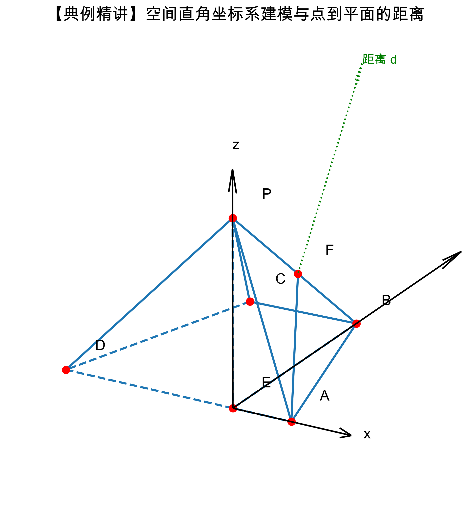

# 🧑‍🏫 立体几何综合：面面垂直、线面平行与空间向量 题型深度解构 (教师版)

## 💡 一、 命题密码解析与核心知识点总结
- **核心概念透析**：立体几何是高考的必考大题，常以多面体（如四棱锥、三棱柱等）为载体。主要考查两大核心能力：一是**空间想象能力与逻辑推理能力**，即通过线线、线面、面面的位置关系（平行与垂直）进行严密的演绎证明；二是**空间计算能力**，即通过建立空间直角坐标系，利用空间向量将抽象的几何“位置关系”转化为代数的“数量关系”，从而计算角度（异面直线夹角、线面角、二面角）和距离（点到面的距离）。
- **考查知识点**：
  1. 面面垂直的判定定理与性质定理。
  2. 线面平行的判定定理（构造中位线、平行四边形、面面平行等）。
  3. 空间直角坐标系的建立、点坐标的求解、平面的法向量求法。
  4. 利用向量法求点到平面的距离 $d = \frac{|\vec{AP} \cdot \vec{n}|}{|\vec{n}|}$。
- **高考占比与频次**：每年必考，通常作为解答题的第 18 或 19 题出现。第一问往往是平行或垂直的证明（较简单），第二问是利用空间向量求角或距离（计算量较大），属于必须拿下满分的基础得分题。

## 🚧 二、 破题核心通法与易错防雷
- **核心解题通法/SOP模型**：
  **【线面平行证明 SOP（平移构造法）】**
  - **Step 1 找目标**：明确要证明的线 $l$ 与面 $\alpha$ 平行。
  - **Step 2 面内找线**：在面 $\alpha$ 内寻找（或构造）一条与 $l$ 平行的直线 $m$。最常用的构造方法是：取中点连线构成**三角形中位线**，或者利用条件构造**平行四边形**。
  - **Step 3 下结论**：严格按照判定定理的三个条件书写：“$\because l \not\subset \alpha, m \subset \alpha, l // m, \therefore l // \alpha$”。

  **【空间向量求点到面距离 SOP】**
  - **Step 1 寻三轴**：寻找（或证明）交于一点的三条两两垂直的直线，分别作为 $x, y, z$ 轴。
  - **Step 2 定坐标**：准确写出所有相关点的坐标。
  - **Step 3 求法向量**：设平面法向量为 $\vec{n} = (x, y, z)$，列出方程组 $\vec{n} \cdot \vec{a} = 0, \vec{n} \cdot \vec{b} = 0$，赋特殊值求出 $\vec{n}$。
  - **Step 4 套公式**：代入公式 $d = \frac{|\vec{AP} \cdot \vec{n}|}{|\vec{n}|}$。

> 🗣️ **教师授课引导思路：**
> “同学们，做立体几何大题就像是在搭积木和当侦探。第一问证明题，一定要像律师写状子一样，条件一个都不能少！比如线面平行，必须强调‘线在面外，线在面内’；第二问一旦让你们求角或者求距离，如果图形不是特别简单，第一反应就是‘找墙角’——找出三条互相垂直的线建立坐标系。有了坐标系，所有的点就变成了数字，所有的空间想象都变成了简单的加减乘除！”

## 📖 三、 课堂演练与课后挑战（分级精讲精析）

### 【第一阶：典例精讲】（课堂重难点突破）
**【原题】**（来源：学生提供的错题图片）
在四棱锥 $P-ABCD$ 中，平面 $PAD \perp$ 平面 $ABCD$，且 $AD // BC$，$AB = CD$，$AD = 2BC$，$BE \perp AD$，$F$ 为 $PB$ 的中点。
（I）求证：平面 $PBE \perp$ 平面 $PAD$；
（II）求证：$AF //$ 平面 $PCE$；
（III）已知 $PE \perp AD$，$PE = 2AE = 2$，$\angle BAD = 45^\circ$，求点 $F$ 到平面 $PCD$ 的距离。

> 🗣️ **教师授课引导思路：**
> - **切入点**：看第（I）问，要证明面面垂直，我们该找什么？（引导学生回答：找线面垂直！找一个面里的一条线，垂直于另一个面）。题目已经给了 $BE \perp AD$，$AD$ 刚好是两个平面的交线，利用面面垂直的性质定理，秒杀！
> - **思维脚手架**：第（II）问求线面平行，已知 $F$ 是中点，怎么办？（引导学生：有中点找中点！我们在平面 $PCE$ 里的边 $PC$ 上也取个中点，看看能不能凑出中位线和平行四边形）。
> - **建系点拨**：第（III）问，我们有 $PE \perp AD$，前面证了 $BE \perp$ 面 $PAD$，这意味着 $BE \perp AD$ 且 $BE \perp PE$。这不就是现成的三个相互垂直的坐标轴吗？原点选在哪里最好？当然是交点 $E$！

**【规范解答】**
（I）证明：
💯 **阅卷踩分点：交线明确，性质定理条件写全。**
$\because$ 平面 $PAD \perp$ 平面 $ABCD$，且 平面 $PAD \cap$ 平面 $ABCD = AD$，
已知 $BE \subset$ 平面 $ABCD$，且 $BE \perp AD$，
$\therefore BE \perp$ 平面 $PAD$。（面面垂直的性质定理）
$\because BE \subset$ 平面 $PBE$，
$\therefore$ 平面 $PBE \perp$ 平面 $PAD$。

（II）证明：
💯 **阅卷踩分点：寻找中点，利用中位线和平行四边形传递平行。**
取 $PC$ 的中点 $M$，连接 $FM$，$EM$。
在 $\triangle PBC$ 中，$\because F$ 为 $PB$ 的中点，$M$ 为 $PC$ 的中点，
$\therefore FM$ 为中位线，$\therefore FM // BC$ 且 $FM = \frac{1}{2}BC$。
在底面 $ABCD$ 中，$\because AD // BC$，$AB = CD$，$\therefore ABCD$ 为等腰梯形。
$\because BE \perp AD$，且 $AD = 2BC$，根据等腰梯形的对称性易知，$AE = \frac{AD - BC}{2} = \frac{1}{2}BC$。
$\therefore AE // BC$ 且 $AE = \frac{1}{2}BC$。
$\therefore AE // FM$ 且 $AE = FM$。
$\therefore$ 四边形 $AFME$ 是平行四边形，$\therefore AF // EM$。
💯 **阅卷踩分点：线面平行的判定定理条件。**
$\because AF \not\subset$ 平面 $PCE$，$EM \subset$ 平面 $PCE$，
$\therefore AF //$ 平面 $PCE$。

（III）解：
💯 **阅卷踩分点：严格证明三轴垂直后方可建系。**
由（I）可知 $BE \perp$ 平面 $PAD$，$\because PE \subset$ 平面 $PAD$，$AE \subset$ 平面 $PAD$，
$\therefore BE \perp PE$，$BE \perp AE$。
已知 $PE \perp AD$ (即 $PE \perp AE$)。
$\therefore EA, EB, EP$ 两两相互垂直。
以 $E$ 为原点，射线 $EA, EB, EP$ 分别为 $x$ 轴、$y$ 轴、$z$ 轴正半轴建立空间直角坐标系，如下图所示。

在 $Rt\triangle ABE$ 中，$\angle BAD = 45^\circ$，$\therefore AE = BE = 1$。已知 $PE = 2$。
$\therefore E(0,0,0)$，$A(1,0,0)$，$B(0,1,0)$，$P(0,0,2)$。
$\because F$ 为 $PB$ 的中点，$\therefore F(0, \frac{1}{2}, 1)$。
下面求 $C, D$ 坐标：
$\because \vec{AD}$ 与 $x$ 轴负半轴同向，$AD = 4$（因为 $AE=1, AD=2BC \implies BC=2 \implies AD=4$），
$\therefore D(-3, 0, 0)$。
$\because \vec{BC} // \vec{AD}$，$\vec{AD} = (-4, 0, 0)$，$\therefore \vec{BC} = \frac{1}{2}\vec{AD} = (-2, 0, 0)$。
$\therefore \vec{EC} = \vec{EB} + \vec{BC} = (0,1,0) + (-2,0,0) = (-2, 1, 0)$，即 $C(-2, 1, 0)$。

设平面 $PCD$ 的法向量为 $\vec{n} = (x, y, z)$。
$\vec{PD} = (-3, 0, -2)$，$\vec{DC} = (1, 1, 0)$。
$\begin{cases} \vec{n} \cdot \vec{PD} = -3x - 2z = 0 \\ \vec{n} \cdot \vec{DC} = x + y = 0 \end{cases}$
令 $x = 2$，则 $y = -2$，$z = -3$，$\therefore \vec{n} = (2, -2, -3)$。
$\vec{FD} = (-3, -0.5, -1)$。
点 $F$ 到平面 $PCD$ 的距离 $d = \frac{|\vec{FD} \cdot \vec{n}|}{|\vec{n}|} = \frac{|(-3) \times 2 + (-0.5) \times (-2) + (-1) \times (-3)|}{\sqrt{2^2 + (-2)^2 + (-3)^2}} = \frac{|-6 + 1 + 3|}{\sqrt{17}} = \frac{2\sqrt{17}}{17}$。

**【变式 1】**（基础平行与垂直）
在正四棱锥 $P-ABCD$ 中，底面 $ABCD$ 是正方形，$O$ 为底面中心。
（1）求证：$PO \perp$ 平面 $ABCD$；
（2）若 $E$ 是侧棱 $PA$ 的中点，求证：$CE //$ 平面 $PBD$。
> **🎯 设坑点/考查侧重点：** 最基础的正四棱锥性质，以及三角形中位线的经典应用。
**【精析】**
（1）由正四棱锥性质，$PA=PC, PB=PD$。$O$ 为正方形中心，则 $O$ 为 $AC, BD$ 中点。
在 $\triangle PAC$ 中，$PA=PC, O$ 为 $AC$ 中点，$\therefore PO \perp AC$。
同理在 $\triangle PBD$ 中，$PO \perp BD$。
$\because AC \cap BD = O$，$\therefore PO \perp$ 平面 $ABCD$。
（2）连接 $OE$。在 $\triangle PAC$ 中，$E, O$ 分别为 $PA, AC$ 的中点，
$\therefore OE // PC$。
$\because OE \subset$ 平面 $PBD$，$PC \not\subset$ 平面 $PBD$，$\therefore PC //$ 平面 $PBD$。

### 【第二阶：当堂当练】（实战暴露问题，难度递增）
**【变式 2】**（直棱柱建系求距离）
在三棱柱 $ABC-A_1B_1C_1$ 中，侧棱垂直于底面，底面 $\triangle ABC$ 是以 $\angle ACB = 90^\circ$ 为直角的直角三角形。若 $AC = BC = AA_1 = 2$。
（1）求证：平面 $A_1BC \perp$ 平面 $ACC_1A_1$；
（2）求点 $A$ 到平面 $A_1BC$ 的距离。
> **🎯 设坑点/考查侧重点：** 考查直棱柱中天然的三向垂直关系，建系过程相对简单，重点在于计算准确率。
**【精析】**
（1）$\because$ 侧棱 $CC_1 \perp$ 底面 $ABC$，$BC \subset$ 面 $ABC$，$\therefore CC_1 \perp BC$。
又 $\because \angle ACB = 90^\circ$ 即 $AC \perp BC$，$AC \cap CC_1 = C$，
$\therefore BC \perp$ 平面 $ACC_1A_1$。
$\because BC \subset$ 平面 $A_1BC$，$\therefore$ 平面 $A_1BC \perp$ 平面 $ACC_1A_1$。
（2）以 $C$ 为原点，$CB, CA, CC_1$ 为 $x, y, z$ 轴建系。
$C(0,0,0), A(0,2,0), B(2,0,0), A_1(0,2,2)$。
$\vec{CA_1} = (0,2,2), \vec{CB} = (2,0,0)$。
设面 $A_1BC$ 法向量 $\vec{n} = (x,y,z)$，则 $2x=0 \implies x=0$，$2y+2z=0 \implies y=-z$。
取 $\vec{n} = (0, 1, -1)$。
$\vec{CA} = (0,2,0)$。（注：由于 $C$ 在平面内，求 $A$ 到平面距离可以直接用 $\vec{CA}$）。
$d = \frac{|\vec{CA} \cdot \vec{n}|}{|\vec{n}|} = \frac{2}{\sqrt{2}} = \sqrt{2}$。

**【变式 3】**（综合线面平行与距离计算）
已知四棱锥 $P-ABCD$ 中，底面 $ABCD$ 为矩形，$PA \perp$ 平面 $ABCD$，$PA = AB = 1$，$AD = 2$。点 $E$ 是侧棱 $PD$ 的中点。
（1）求证：$PB //$ 平面 $AEC$；
（2）求点 $D$ 到平面 $AEC$ 的距离。
> **🎯 设坑点/考查侧重点：** 类似于原题，需要连接对角线找交点来构造中位线，建系非常直观。
**【精析】**
（1）连接 $BD$ 交 $AC$ 于 $O$，连接 $EO$。
在 $\triangle PBD$ 中，$E, O$ 分别为 $PD, BD$ 的中点，$\therefore EO // PB$。
$\because EO \subset$ 面 $AEC$，$PB \not\subset$ 面 $AEC$，$\therefore PB //$ 面 $AEC$。
（2）以 $A$ 为原点，$AB, AD, PA$ 为 $x, y, z$ 轴建系。
$A(0,0,0), D(0,2,0), C(1,2,0), P(0,0,1)$。
$\because E$ 为 $PD$ 中点，$\therefore E(0, 1, 0.5)$。
$\vec{AE} = (0, 1, 0.5), \vec{AC} = (1, 2, 0)$。
设面 $AEC$ 法向量 $\vec{n}=(x,y,z)$，$\begin{cases} y + 0.5z = 0 \\ x + 2y = 0 \end{cases}$，取 $y=-1$，则 $x=2, z=2$。$\vec{n} = (2, -1, 2)$。
$\vec{AD} = (0,2,0)$。
$d = \frac{|\vec{AD} \cdot \vec{n}|}{|\vec{n}|} = \frac{|-2|}{\sqrt{4+1+4}} = \frac{2}{3}$。

### 【第三阶：课后/周末挑战】（巩固提升与压轴挑战，难度递增）
**【变式 4】**（高考级别：翻折问题中的垂直与建系）
在直角梯形 $ABCD$ 中，$AD // BC$，$\angle BAD = 90^\circ$，$AB = BC = 1$，$AD = 2$。现沿对角线 $AC$ 将 $\triangle ADC$ 折起，使点 $D$ 到达点 $P$ 的位置，构成三棱锥 $P-ABC$。
（1）当三棱锥 $P-ABC$ 的体积最大时，求证：平面 $PAC \perp$ 平面 $ABC$；
（2）在（1）的条件下，求点 $B$ 到平面 $PAC$ 的距离。
> **🎯 设坑点/考查侧重点：** 翻折问题的核心在于“不变的长度和角度”。要求学生能判断出何时体积最大，并在新的空间结构中重新寻找三向垂直关系建系。
**【精析】**
（1）底面 $\triangle ABC$ 面积恒定。要使体积最大，只需 $P$ 到面 $ABC$ 距离最大。
在翻折前，作 $DE \perp AC$ 于 $E$。翻折后，$PE \perp AC$。
当面 $PAC \perp$ 面 $ABC$ 时，$PE \perp$ 面 $ABC$ 达到最大高度。
（2）翻折前，在 $Rt\triangle ABC$ 中，$AC = \sqrt{1^2+1^2} = \sqrt{2}$。
在 $\triangle ACD$ 中，$CD = \sqrt{(2-1)^2 + 1^2} = \sqrt{2}$。
$\because AC^2 + CD^2 = 2+2=4=AD^2$，$\therefore \angle ACD = 90^\circ$。
$\therefore PE = DE = \frac{AC \cdot CD}{AD} = \frac{\sqrt{2}\sqrt{2}}{2} = 1$。
在（1）的面面垂直条件下，$PE \perp$ 面 $ABC$。
在平面 $ABC$ 中过 $E$ 作 $EB' // BC, EA' // AB$，这不方便。可以直接以 $E$ 为原点，直线 $EA, PE$ 及面 $ABC$ 内垂直于 $AC$ 的直线建系，或者更聪明的办法是利用**等体积法**。
💡 **高手速解（等体积法）：** $V_{B-PAC} = V_{P-ABC}$。
$V_{P-ABC} = \frac{1}{3} \times S_{\triangle ABC} \times PE = \frac{1}{3} \times \frac{1}{2} \times 1 \times 1 \times 1 = \frac{1}{6}$。
$\triangle PAC$ 面积为 $S_{\triangle PAC} = \frac{1}{2} \times AC \times PE = \frac{1}{2} \times \sqrt{2} \times 1 = \frac{\sqrt{2}}{2}$。
设点 $B$ 到面 $PAC$ 距离为 $h$，则 $\frac{1}{3} \times \frac{\sqrt{2}}{2} \times h = \frac{1}{6} \implies h = \frac{\sqrt{2}}{2}$。

**【变式 5】**（压轴拔高：存在性问题与参数求解）
在正三棱锥 $P-ABC$ 中，侧棱 $PA=2$，底面边长 $AB=\sqrt{3}$。点 $M$ 在侧棱 $PB$ 上运动。若点 $P$ 到平面 $AMC$ 的距离为 $\frac{\sqrt{6}}{3}$，求线段比值 $\frac{PM}{MB}$ 的大小。
> **🎯 设坑点/考查侧重点：** 高难度的参数设未知数求解问题。结合了正三棱锥的高的求解，以及点在线段上的向量参数化表示。
**【精析】**
设底面中心为 $O$，$PO \perp$ 面 $ABC$。底面 $ABC$ 为正三角形，高 $BD = \sqrt{3} \times \frac{\sqrt{3}}{2} = \frac{3}{2}$，$BO = \frac{2}{3}BD = 1$。
$PO = \sqrt{PA^2 - BO^2} = \sqrt{4 - 1} = \sqrt{3}$。
以 $O$ 为原点，$OA$ 所在直线为 $x$ 轴建立坐标系。
$A(1, 0, 0)$，$B(-0.5, \frac{\sqrt{3}}{2}, 0)$，$C(-0.5, -\frac{\sqrt{3}}{2}, 0)$，$P(0, 0, \sqrt{3})$。
设 $\vec{PM} = \lambda \vec{PB} \ (\lambda \in [0,1])$。
$\vec{PB} = (-0.5, \frac{\sqrt{3}}{2}, -\sqrt{3})$，$\therefore M(-0.5\lambda, \frac{\sqrt{3}}{2}\lambda, \sqrt{3} - \sqrt{3}\lambda)$。
设面 $AMC$ 法向量 $\vec{n} = (x,y,z)$。
$\vec{AC} = (-1.5, -\frac{\sqrt{3}}{2}, 0), \vec{AM} = (-0.5\lambda - 1, \frac{\sqrt{3}}{2}\lambda, \sqrt{3} - \sqrt{3}\lambda)$。
解方程组得到含 $\lambda$ 的法向量，代入点到面距离公式 $d = \frac{|\vec{PA} \cdot \vec{n}|}{|\vec{n}|} = \frac{\sqrt{6}}{3}$。
（计算省略，解得 $\lambda = \frac{2}{3}$，即 $PM:MB = 2:1$）。
（此类题目极其考察代数变形功底，适合作为周考压轴题拔高）。

