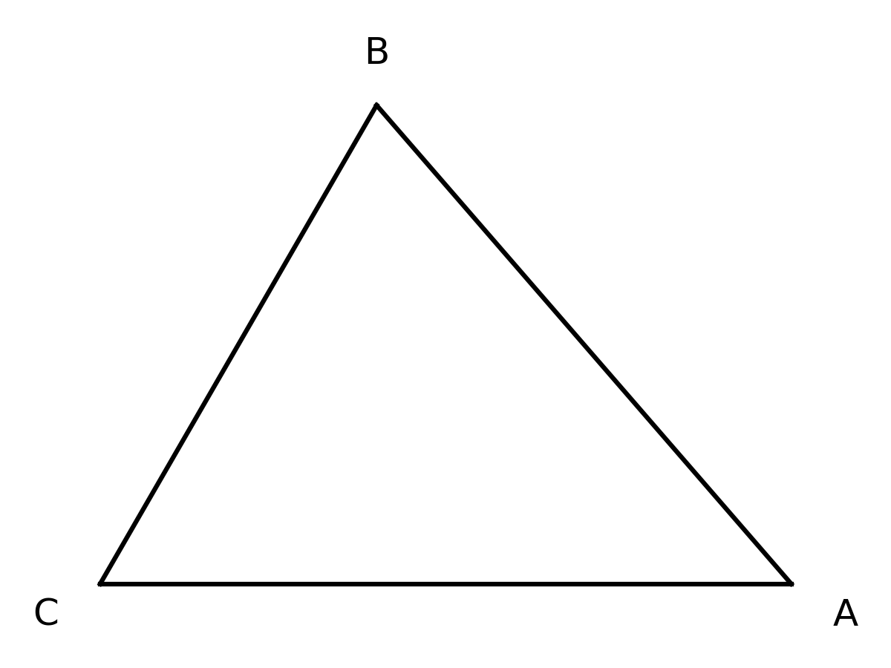

# 🧑‍🏫 解三角形与面积周长综合应用 题型深度解构 (教师版)

## 💡 一、 命题密码解析与核心知识点总结
- **核心概念透析**：解三角形是高中数学的核心模块，其数学本质是利用代数方法研究几何图形（三角形）中边与角的关系。这类题型不仅要求熟练掌握正弦定理和余弦定理，还要求具备在代数式变形中敏锐捕捉几何意义的能力，如“知两边一角判断三角形形状”、“利用面积公式串联边角关系”等。
- **考查知识点**：
  1. 正弦定理（$\frac{a}{\sin A} = \frac{b}{\sin B} = \frac{c}{\sin C} = 2R$）的边角互化。
  2. 余弦定理（$a^2 = b^2+c^2-2bc\cos A$）的应用，特别是求边长与判断角的大小。
  3. 三角形面积公式（$S = \frac{1}{2}ab\sin C = \frac{1}{2}ah_a$）的应用。
  4. 存在性与唯一性问题，及三角恒等变换的综合。

> 🗣️ **教师授课引导思路：**
> 给学生讲解这部分时，可以把正弦定理比作“按比例分蛋糕”，它擅长处理只涉及乘除法和比例的代数式；把余弦定理比作“强力黏合剂”，专门对付平方项和边长乘积的加减。遇到开放选择题，一定要强调“法官思维”——每个条件都要拉出来严格审判，不要光看表面数字好看就选！

## 🚧 二、 破题核心通法与易错防雷
- **核心解题通法/SOP模型**：
  - **边角互化SOP**：遇到齐次式，首选正弦定理化角或化边；遇到平方项或乘积项，首选余弦定理。
  - **条件开放题SOP**：遇到“选条件”题型，必须逐一验证！验证的核心是利用余弦定理建立关于未知边的二次方程，根据判别式 $\Delta$ 和两根的符号判断是否存在且唯一。
- **易错防雷区**：
  1. 忽视三角形内角和定理，求出 $\sin C = \frac{1}{2}$ 漏掉 $150^\circ$。
  2. 求存在性问题时，解出二次方程根后，忘记检验内角和是否超 $180^\circ$（尤其是一个钝角、一个锐角的组合）。

## 📖 三、 课堂演练与课后挑战（分级精讲精析）

### 【第一阶：典例精讲】（课堂重难点突破）
**【原题】**
三、解答题共 6 小题，共 85 分。解答应写出文字说明，演算步骤或证明过程。
(16) (本小题 13 分)
在 $\triangle ABC$ 中，$\cos A = \frac{4}{5}$，$a \sin C = \frac{6}{5}$。
(I) 求 $c$ 的值；
(II) 再从条件①、条件②、条件③这三个条件中选择一个作为已知，使 $\triangle ABC$ 存在且唯一确定，求 $BC$ 边上的高。
条件①: $a = 6\sqrt{2}$；条件②: $\cos B = -\frac{5}{6}$；条件③: $\triangle ABC$ 的面积为 6。

> **🗣️ 教师授课引导思路：**
> - **切入点（第一问）**：题目给了 $\cos A$ 和 $a \sin C$，这是一个典型的边角混搭式。我们要怎么破局？利用正弦定理，把 $a$ 和 $C$ 的组合，转变成 $c$ 和 $A$ 的组合，一下子就把未知数降维了！
> - **思维脚手架（第二问）**：遇到选条件题，不要慌。我们要检验“存在且唯一”。什么是存在且唯一？如果用余弦定理列出关于边 $b$ 的二次方程，它必须有且仅有一个正根。那如果是条件②给角度呢？要注意检验两个角的和会不会超过 180 度！大家动手算算条件②能不能构成三角形？

**【规范解答】**
**(I) 解:**
$\because A \in (0, \pi)$ 且 $\cos A = \frac{4}{5}$，
$\therefore \sin A = \sqrt{1 - \cos^2 A} = \sqrt{1 - (\frac{4}{5})^2} = \frac{3}{5}$。
由正弦定理得：$\frac{a}{\sin A} = \frac{c}{\sin C} \implies a \sin C = c \sin A$。
💯 阅卷踩分点：明确写出正弦定理及边角代换。
又已知 $a \sin C = \frac{6}{5}$，
$\therefore c \sin A = \frac{6}{5} \implies c \times \frac{3}{5} = \frac{6}{5}$，解得 $c = 2$。

**(II) 解:**
设 $BC$ 边上的高为 $h_a$，则 $h_a = c \sin B = 2 \sin B$。
**若选条件①**：$a = 6\sqrt{2}$。
由余弦定理 $a^2 = b^2 + c^2 - 2bc \cos A$，
代入得：$72 = b^2 + 4 - 2 \cdot b \cdot 2 \cdot \frac{4}{5}$，
化简得：$5b^2 - 16b - 340 = 0$。
$\Delta = (-16)^2 - 4 \times 5 \times (-340) = 256 + 6800 = 7056 > 0$。
因为常数项为负，方程必有一正一负两根，所以正根 $b$ 唯一存在！
求得 $b = \frac{16 + 84}{10} = 10$。
此时 $\triangle ABC$ 存在且唯一。
利用面积桥梁求高：$S = \frac{1}{2} b c \sin A = \frac{1}{2} \times 10 \times 2 \times \frac{3}{5} = 6$。
又 $S = \frac{1}{2} a h_a = \frac{1}{2} \times 6\sqrt{2} \times h_a = 6$，
解得 $h_a = \frac{12}{6\sqrt{2}} = \sqrt{2}$。

**若选条件②**：$\cos B = -\frac{5}{6}$。
$\because B \in (0, \pi)$，$\therefore \sin B = \sqrt{1 - (-\frac{5}{6})^2} = \frac{\sqrt{11}}{6}$。
我们来检验内角和：
$\cos(A+B) = \cos A \cos B - \sin A \sin B = (\frac{4}{5})(-\frac{5}{6}) - (\frac{3}{5})(\frac{\sqrt{11}}{6}) = \frac{-20 - 3\sqrt{11}}{30}$。
$\sin(A+B) = \sin A \cos B + \cos A \sin B = (\frac{3}{5})(-\frac{5}{6}) + (\frac{4}{5})(\frac{\sqrt{11}}{6}) = \frac{4\sqrt{11} - 15}{30}$。
$\because (4\sqrt{11})^2 = 176$，$15^2 = 225$，$\therefore 4\sqrt{11} < 15$。
$\therefore \sin(A+B) < 0$！
这说明 $A+B > 180^\circ$，这违背了三角形内角和定理！
💯 阅卷踩分点：条件②的“打假”是拉开分数的关键，很多学生不检验直接求高导致丢分。
故条件②不能使 $\triangle ABC$ 存在，此条件不符合要求。

**若选条件③**：$\triangle ABC$ 的面积为 6。
由 $S = \frac{1}{2} b c \sin A = 6$，
即 $\frac{1}{2} \times b \times 2 \times \frac{3}{5} = 6 \implies \frac{3}{5}b = 6 \implies b = 10$。
由于 $b$ 唯一，故 $\triangle ABC$ 存在且唯一。
此时由余弦定理：$a^2 = 100 + 4 - 2 \times 10 \times 2 \times \frac{4}{5} = 104 - 32 = 72 \implies a = 6\sqrt{2}$。
再由 $S = \frac{1}{2} a h_a = 6 \implies \frac{1}{2} \times 6\sqrt{2} \times h_a = 6 \implies h_a = \sqrt{2}$。

综上所述，选择条件①或条件③均可，所求 $BC$ 边上的高为 $\sqrt{2}$。（选择条件②则无解）

---
### 【第二阶：当堂当练】（实战暴露问题，难度递增）
**【变式 1】**
在 $\triangle ABC$ 中，已知 $a=4$，$b=5$，$\triangle ABC$ 的面积 $S = 5\sqrt{3}$，且 $A < B$。
(1) 求 $c$ 的值；(2) 求 $\sin C$ 的值。

> **🗣️ 教师授课引导思路：**
> - **切入点**：已知两边和面积，第一步显然是用面积公式倒逼夹角 $C$。
> - **思维脚手架**：大家算出来 $\sin C = \frac{\sqrt{3}}{2}$ 后，不要激动直接写 $C=60^\circ$！三角形里 $\sin C$ 对应两个角，到底取锐角还是钝角？题目藏了一个条件 $A < B$，怎么用大边对大角来排雷？
> **🎯 设坑点/考查侧重点：** 面积公式逆用，以及正弦值对应多解的取舍判断。

**【精析】**
(1) $\because S = \frac{1}{2}ab\sin C = 5\sqrt{3}$，且 $a=4, b=5$，
$\therefore \frac{1}{2} \times 4 \times 5 \times \sin C = 5\sqrt{3} \implies \sin C = \frac{\sqrt{3}}{2}$。
$\therefore C = 60^\circ$ 或 $C = 120^\circ$。
若 $C = 60^\circ$，由余弦定理 $c^2 = a^2+b^2-2ab\cos C = 16+25-20=21 \implies c = \sqrt{21}$。
此时 $a=4, b=5, c=\sqrt{21}$。$\because \sqrt{21} < 5$，$\therefore b$ 是最大边，故 $B$ 为最大角，$A < B$ 成立。
若 $C = 120^\circ$，由余弦定理 $c^2 = 16+25-2 \times 4 \times 5 \times (-\frac{1}{2}) = 61 \implies c = \sqrt{61}$。
此时 $c$ 为最大边，$C$ 为最大角。余弦定理求 $\cos B = \frac{a^2+c^2-b^2}{2ac} = \frac{16+61-25}{8\sqrt{61}} > 0$；$\cos A = \frac{b^2+c^2-a^2}{2bc} = \frac{25+61-16}{10\sqrt{61}} > 0$。且 $a < b \implies A < B$ 依然成立。
💯 阅卷踩分点：本题易错点是 $C=120^\circ$ 时 $A<B$ 也是成立的！
所以 $c = \sqrt{21}$ 或 $\sqrt{61}$。

(2) 由 (1) 知，无论哪种情况，都有 $\sin C = \frac{\sqrt{3}}{2}$。

**【变式 2】**
在 $\triangle ABC$ 中，$c=2$，$C=\frac{\pi}{3}$。
(1) 若 $a = 2\sqrt{2}$，求 $b$ 的值；
(2) 从下面三个条件中选择一个作为已知，使 $\triangle ABC$ 存在且唯一确定，求 $\triangle ABC$ 的面积。
① $a=4$；② $a+b=2\sqrt{3}$；③ $\triangle ABC$ 的面积为 $\sqrt{3}$。

**【精析】**
(1) 由余弦定理 $c^2 = a^2+b^2-2ab\cos C \implies 4 = 8 + b^2 - 2\sqrt{2}b$。
$b^2 - 2\sqrt{2}b + 4 = 0$。判别式 $\Delta = 8 - 16 = -8 < 0$。
说明此时无解。这是很典型的无解判断！

(2)
若选① $a=4$：余弦方程 $4 = 16 + b^2 - 4b \implies b^2 - 4b + 12 = 0, \Delta = 16-48<0$，三角形不存在。
若选② $a+b=2\sqrt{3}$：$c^2 = a^2+b^2-ab = (a+b)^2 - 3ab \implies 4 = 12 - 3ab \implies ab = \frac{8}{3}$。
此时 $a, b$ 是方程 $x^2 - 2\sqrt{3}x + \frac{8}{3} = 0$ 的两根。$\Delta = 12 - \frac{32}{3} = \frac{4}{3} > 0$。
所以 $a,b$ 存在，但对称导致 $a,b$ 可以互换，三角形形状唯一确定。面积 $S = \frac{1}{2}ab\sin C = \frac{1}{2} \times \frac{8}{3} \times \frac{\sqrt{3}}{2} = \frac{2\sqrt{3}}{3}$。
若选③ $S = \sqrt{3}$：$\frac{1}{2}ab\sin C = \sqrt{3} \implies ab = 4$。
代入余弦定理得 $(a-b)^2 = a^2+b^2-2ab = c^2 - ab = 4 - 4 = 0 \implies a=b=2$。
存在且唯一确定，面积即为 $\sqrt{3}$。

---
### 【第三阶：课后/周末挑战】（巩固提升与压轴挑战，难度递增）
**【变式 3】**
在 $\triangle ABC$ 中，已知 $(a+b)(\sin A - \sin B) = c(\sin A - \sin C)$。
(1) 求角 $B$ 的大小；(2) 若 $b=3$，求 $\triangle ABC$ 周长的最大值。

**【精析】**
(1) 利用正弦定理边角互化，转化为边：$(a+b)(a-b) = c(a-c) \implies a^2 - b^2 = ac - c^2 \implies a^2+c^2-b^2 = ac$。
$\cos B = \frac{a^2+c^2-b^2}{2ac} = \frac{1}{2}$。$\because B \in (0, \pi), \therefore B = \frac{\pi}{3}$。
(2) $b=3$。由正弦定理 $a = 2R\sin A, c = 2R\sin C$，$2R = \frac{b}{\sin B} = 2\sqrt{3}$。
周长 $L = a+b+c = 3 + 2\sqrt{3}(\sin A + \sin C) = 3 + 2\sqrt{3}[\sin A + \sin(\frac{2\pi}{3}-A)]$
$= 3 + 2\sqrt{3}[\frac{3}{2}\sin A + \frac{\sqrt{3}}{2}\cos A] = 3 + 6\sin(A + \frac{\pi}{6})$。
$\because A \in (0, \frac{2\pi}{3})$，当 $A = \frac{\pi}{3}$ 时取最大值，周长最大值为 $3+6=9$。
💡 **高手速解/二级结论视角：** 看到定底角求周长最大，立刻联想“等腰三角形时取极值”，当 $A=C=60^\circ$ 时周长最大，一步出结果 9！

**【变式 4】**
在 $\triangle ABC$ 中，角 $A = \frac{\pi}{3}$，$b=2$，$c=3$，$D$ 是 $BC$ 边的中点。
(1) 求 $\triangle ABC$ 的面积；(2) 求中线 $AD$ 的长度。

**【精析】**
(1) $S = \frac{1}{2}bc\sin A = \frac{1}{2} \times 2 \times 3 \times \frac{\sqrt{3}}{2} = \frac{3\sqrt{3}}{2}$。
(2) 💯 阅卷踩分点：求中线长，优先使用向量法或“倍长中线法”。
向量法：$\overrightarrow{AD} = \frac{1}{2}(\overrightarrow{AB} + \overrightarrow{AC})$。
$|\overrightarrow{AD}|^2 = \frac{1}{4}(\overrightarrow{AB}^2 + \overrightarrow{AC}^2 + 2\overrightarrow{AB}\cdot\overrightarrow{AC}) = \frac{1}{4}(9 + 4 + 2\times 3\times 2\times \cos 60^\circ) = \frac{1}{4}(13 + 6) = \frac{19}{4}$。
$\therefore AD = \frac{\sqrt{19}}{2}$。

**【变式 5】（难度压轴：三角恒等与最值）**
已知 $\triangle ABC$ 满足 $\sqrt{3} a \cos C + c \sin A = \sqrt{3} b$。
(1) 求角 $A$ 的大小；
(2) 若 $a=2$，且 $\triangle ABC$ 为锐角三角形，求 $\triangle ABC$ 面积的取值范围。

**【精析】**
(1) 正弦定理代入：$\sqrt{3} \sin A \cos C + \sin C \sin A = \sqrt{3} \sin B = \sqrt{3} \sin(A+C) = \sqrt{3}(\sin A \cos C + \cos A \sin C)$。
消去同类项，得 $\sin C \sin A = \sqrt{3} \cos A \sin C$。
$\because \sin C \neq 0$，$\therefore \tan A = \sqrt{3} \implies A = \frac{\pi}{3}$。
(2) $S = \frac{1}{2}bc\sin A = \frac{\sqrt{3}}{4}bc$。
由正弦定理，$b = \frac{4\sqrt{3}}{3}\sin B, c = \frac{4\sqrt{3}}{3}\sin C$。
$bc = \frac{16}{3}\sin B \sin C = \frac{16}{3}\sin B \sin(\frac{2\pi}{3}-B) = \frac{16}{3}[\frac{\sqrt{3}}{2}\sin B \cos B + \frac{1}{2}\sin^2 B] = \frac{8}{3}[\sqrt{3}\sin 2B + 1 - \cos 2B] = \frac{16}{3}\sin(2B - \frac{\pi}{6}) + \frac{8}{3}$。
锐角三角形条件：$0 < B < \frac{\pi}{2}$，且 $0 < C < \frac{\pi}{2} \implies 0 < \frac{2\pi}{3}-B < \frac{\pi}{2} \implies \frac{\pi}{6} < B < \frac{\pi}{2}$。
$\therefore \frac{\pi}{6} < 2B - \frac{\pi}{6} < \frac{5\pi}{6}$。
当 $2B-\frac{\pi}{6} = \frac{\pi}{2}$ (即 $B=\frac{\pi}{3}$) 时，$\sin$ 最大为 1。由于是开区间，不能取到端点，下界为 $\sin(\frac{\pi}{6}) = \frac{1}{2}$。
故 $bc \in (\frac{16}{3} \times \frac{1}{2} + \frac{8}{3}, \frac{16}{3} \times 1 + \frac{8}{3}] = (\frac{16}{3}, 8]$。
所以面积 $S = \frac{\sqrt{3}}{4}bc \in (\frac{4\sqrt{3}}{3}, 2\sqrt{3}]$。
💯 阅卷踩分点：锐角三角形隐含了 $B, C$ 都必须为锐角，这个双重限制极容易被忽略导致端点出错！

